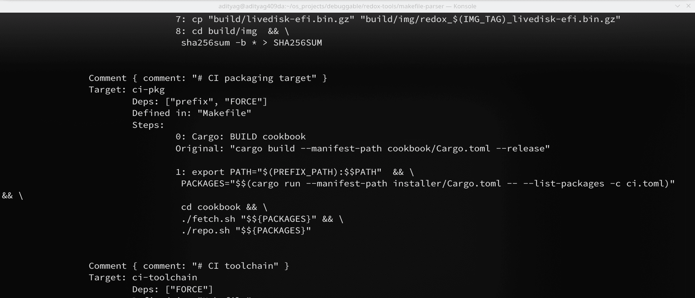

## Makefile Parser


It should be readable, only thing is few files have say > 100 LoC, various structs in same file...

Mainly I wrote this to visualise Redox Operating System's internal build process

#### Usage

```sh
cargo run -- ~/os_projects/debuggable/redox/Makefile
```

#### Screenshot



:)

